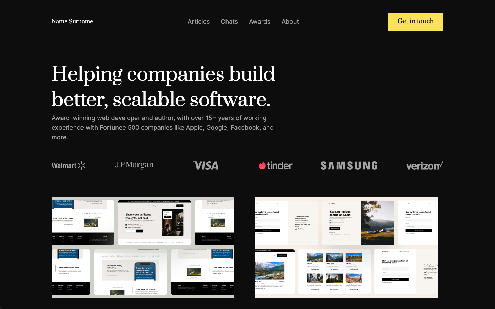

# Codewell - Profile card component solution

This is a solution to the [Web Developer Portfolio challenge on Codewell](https://www.codewell.cc/challenges/web-developer-portfolio--617d4897a383e41090a3e46f). 

## Table of contents

- [Overview](#overview)
  - [Screenshot](#screenshot)
  - [Links](#links)
- [My process](#my-process)
  - [Built with](#built-with)
  - [What I learnt](#what-i-learnt)
  - [Continued development](#continued-development)
- [Author](#author)

## Overview

### Screenshot

### Links

- Solution URL: [github.com/ntjnh/cw-developer-portfolio](https://github.com/ntjnh/cw-developer-portfolio)
- Live Site URL: [ntjnh-cw-dev-portfolio.netlify.app](https://ntjnh-cw-dev-portfolio.netlify.app)

## My process

### Built with

- React
- Semantic HTML5 markup
- TailwindCSS
- Flexbox
- Mobile-first approach

### What I learnt

When I was working on the logos, the flame icon with the gradient in the Tinder logo wasn't displaying properly. I thought it might be because of the way I was using all the SVGs as `` elements. I did some Googling and ended up on Stack Overflow, of course. This is where I found what to do about two-word attributes when using SVG code in JSX. So I made separate components for each logo and then imported them into the Logos component and that's when the flame started appearing as expected.

### Continued development

I made the mistake of starting with the desktop design, which meant I had to then work my way down. I didn't do it on purpose, it was more absent-mindedness on my part. I do prefer the mobile-first approach but because of how backwards the dev process is in my current job, that's how most of the websites are built. Too much importance is places on desktop when that isn't even the most common device for most websites. So because of this, when we are given websites to build, we always get desktop designs only. So this is a very bad habit that I am _desperately_ trying to break.

## Author

- Website - [Nate](https://natejonah.com)
- Github - [ntjnh](https://github.com/ntjnh)
